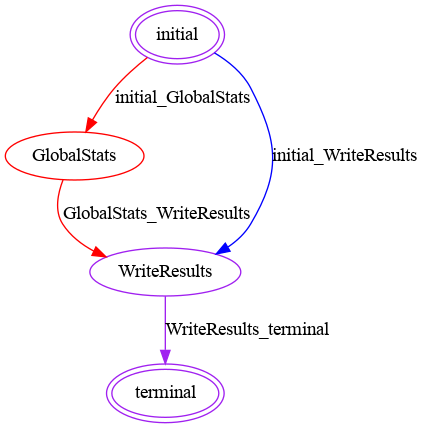

# Image Normalization FeatureCloud App

## Description
Using Image Normalization app, users  can normalize and/or standardize their local image datasets with different techniques in FeatureCloud platform.
This app supports image datasets with .npy format(numpy files).

## Input
- train.npy containing the local training data  
- test.npy containing the local test data
Each of `train.npy` and `test.npy` include to columns with same number of items [images, labels]
## Output
- train.npy: Normalized training data 
- test.npy: Normalized test data
Both files have same structured as the input files.
  
## Methods
- variance:     x<sub>j</sub> = (x<sub>j</sub> - &mu;<sub>j</sub>) / &sigma;<sub>j</sub>

Where
- x: inputs image
- j: channel index
- &mu;<sub>j</sub>: global mean for channel j
- &sigma;<sub>j</sub>: global standard deviation for channel j
  
    

## Workflows
Image Normalization app can be used alongside of following apps in a same workflow:
- Pre: Cross Validation for Image datasets
- Post: Various Analysis apps that support `.npy` format for their input files (e.g. Deep Learning)


## Config
Following config information should be included in the `config.yml` to run the Image Normalization app in a workflow:
```
fc_image_normalization:
  local_dataset:
    train: train.npy
    test: test.npy
    target_value: same-sep
  method: variance
  logic:
    mode: file
    dir: .
  use_smpc: false
  result:
    train: train.npy
    test: test.npy
```