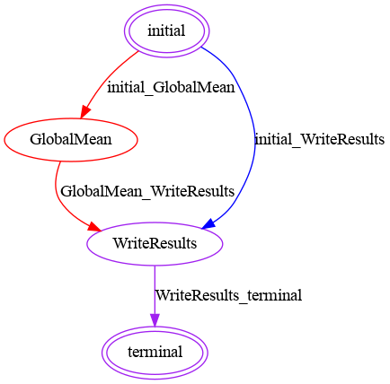

## FeatureCloud Mean app
Mean app is an example app to illustrate simple states, operation, and communications in a FeatureCloud app, witch
includes four states to send the average of the local dataset and get the global mean as an outcome.


 As input it gets a `csv` file named `data.csv` from each client, calculates local mean and communicate it with the controller.
controller, depending on the received data, based on usage of SMPC module, calculates the global mean and sends it back to clients.
Finally, clients write the global mean into an output file.

### Config

```angular2html
fc_mean:
  local_dataset:
    data: data.csv
  logic:
    mode: file
    dir: .
  axis: 0
  use_smpc: false
  result:
    mean: mean.txt
```
Mean app can be used with secure SMPC aggregation to aggregate local datasets in three possible ways based on `axis`.
`axis` can get one of these values:
- `None`: each client will send the mean value of its dataset(scalar value will be communicated).
- `0`: client will send mean value for each column, or feature.
- `1`: same as `0`, but, the number of samples are also will be sent to have a weighted average.