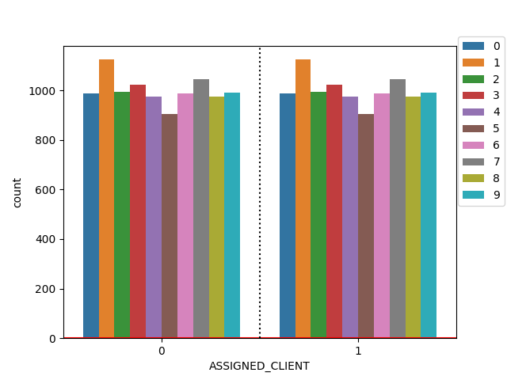
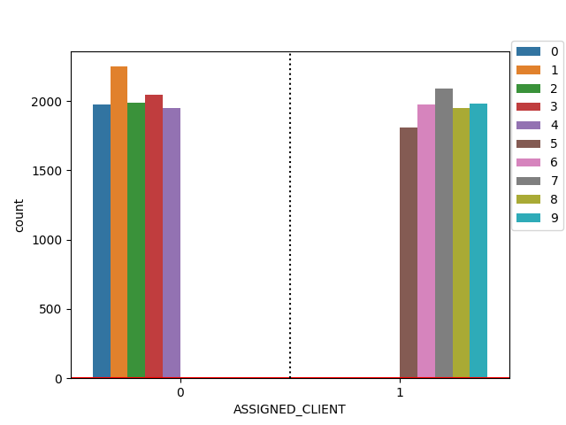

# FeatureCloud Experiment
### Easy experiment with FeatureCloud platform
## Description
Using FeatureCloud Experiment app, users can experiment with different FeatureCloud applications
just by sharing tokens. Usually, FeatureCloud participants, both coordinator and clients, need to 
have their own private data, and globally shared config file for to conduct an experiment in a federated
fashion with FeatureCloud platform; however, with FeatureCloud Experiment app, only the coordinator should 
upload a centralized data and config file to start a workflow, while other clients can join by invitation
token.

FeatureCloud Experiment provide an easy way to distribute centralized data across clients with different levels of data heterogeneity.
FeatureCloud Experiment supports IID (Independent and Identically Distributed) and Non-IID sampling.
Currently, FeatureCloud Experiment, supports distribution of classification data, where IID sampling of data is possible
regardless of number of class labels. In the Data set, each sample should include an arbitrary number of features
and a single class label from a finite discrete set of labels.
In NonIID sampling of data, to simulate different levels of data heterogeneity across clients, An arbitrary
number of clients and class labels are supported. Number of clients that have access to samples of a specific
class labels can be arbitrary while Non-IID-ness of sampling lies in number of clients that have access to samples from
each unique class label.

## Input
- centralized data file: csv, txt, and npy(NumPy) file extensions are supported.  
   
## Output
- client's dataset: With corresponding file extension as the input file: 

## Sampling

- IID: Balanced, independent and identically distributed data for different clients.
- Non-IID: Different levels data heterogeneity in terms of number of clients that have access to samples from
specific class label.

### IID (Independent and Identically Distributed)



### Non-IID

Non-IID-ness can vary based on number of clients that have access to a specific class-label.
For Instance, here, Non-IID(1) is plotted, where samples of each class labels can be found in
local data of one client(No more clients will get such samples). In case there be less clients
than the level of Non-IID-ness, fewer clients may get samples of a specific class. In that regard,
Non-IID-ness is an upper bound of label availability.



## Workflows
FeatureCloud Experiment loads and distributes centralized data at one of clients, and then, broadcasts clients' data to them.
Each client stores its data locally that can be used in future experiments with FeatureCloud applications.
- FeatureCloud Experiment should be used as a first application in a workflow; however, practitioners and researchers may employ
    it on previously processed data in FeatureCloud platform. 
- Post: Various chain of applications can be used after FeatureCloud Experiment app
  (e.g. Image normalization, Cross Validation, and/or Deep Learning)

## Config
Following config information should be included in the `config.yml` to run the FeatureCloud Experiment app in a workflow:
```
fc_data_distributor:
  dataset:
    filename: "data.npy"
    task: "classification"
    target_value: 'same-sep'
    sep: ","
  sampling:
    type: "Non-IID"
    non_iid_ness: 1
```

##Config file options:
- Dataset: includes name of the dataset, the application that data should be preprocessed for, and the target value file. 
  The config files includes the name of the centralized data, which can have different extensions.
  - Data extension: data file can be three formats of `.txt`, `.csv`, and `.npy` 
    - `.npy`: NumPy files are supported which can be used with Deep Learning app (and its companion apps).
      for NumPy file the target value(Label) can be placed at a separate Numpy array or at the end of the sample
      array.
    - `.csv`: These files can used with different separator, while the name of label column should be provided.
      Indexes will be ignored and not being added to the result file.
    - `.txt`: Same as `.csv` files. 
  - Task: The task that the centralized data should be distributed for. 
    The task name is not case-sensitive and can be:
      - 'Classification'
      - 'Regression'
      - 'Clustering' 
  - Target Value: For CSV and TXT files, conveniently, target values are in a column; however,
      Where there are no target values, for instance for Clustering data, the provided target value 
      option will be ignored. For NumPy files, it can be either in the same or separate file.  
    - CSV: the target value config option is the name of column that contains the target value.
    - TXT: Same as CSV.
    - NumPy: for Numpy files there are two general options:
      - Inside: the target value should be in same file as features.
        - `same-sep`: In the same file as features, but in separate array.
        - `same-last`: In the same file and at the end of each sample's features array.
      - Outside:
        - name: name of the file of target values with `.npy` extension. 
          Both feature and target value files should have the same number of items, with same order of appearances.
- Sampling: Includes sampling type and the level data heterogeneity.
  - Type: Sampling type options are two and neither are case-sensitive:
    - `IID`
    - `Non-IID`: Currently only classification data are supported!
  - Non-IID-ness: The level on Non-IID-ness can vary between 1 and the number of labels;
  And it will be ignored for IID sampling.